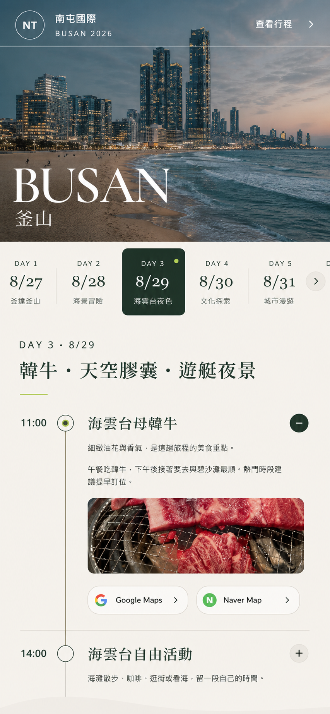
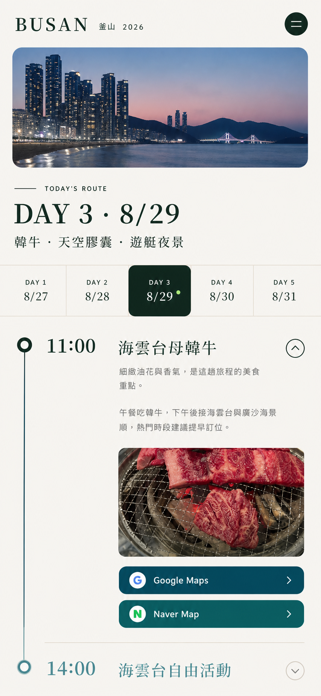
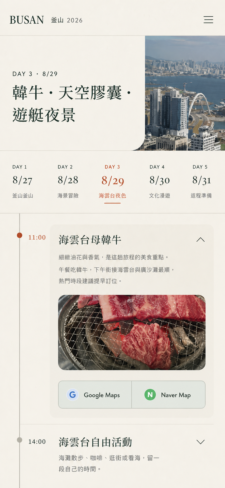

# 南屯團隊｜釜山 2026 UI/UX Redesign Spec

> 狀態：第一階段完成（現況 Audit + redesign specification）  
> 日期：2026-08-22  
> 產品：5 天 4 夜釜山團體行程響應式網站  
> 主要使用情境：旅途中以手機快速確認「今天去哪裡、幾點集合、如何導航」

## 1. Audit scope

本次 Audit 使用本機實際網站、現有程式碼與當次擷取畫面，檢查：

- Desktop：1440 × 1024
- Mobile：390 × 844
- 首頁入口、行程入口、日期切換、行程時間軸與展開內容
- 視覺層級、Typography、Color palette、Spacing、Cards、Navigation、Hero、Itinerary UI、Mobile usability
- 截圖可辨識的 UX 與 accessibility 風險；不宣稱完整 WCAG 合規

### Audit evidence

1. [Desktop 首頁](audit-screenshots/01-desktop-start.png) — 健康度：良好，品牌衝擊力強
2. [Desktop 行程入口](audit-screenshots/02-desktop-itinerary.png) — 健康度：尚可，結構清楚但首屏資訊效率偏低
3. [Mobile 首頁](audit-screenshots/03-mobile-start.png) — 健康度：尚可，氣氛完整但實用入口偏弱
4. [Mobile 行程入口](audit-screenshots/04-mobile-itinerary.png) — 健康度：需改善，標題換行與橫向操作成本高
5. [Mobile 每日行程](audit-screenshots/05-mobile-day-detail.png) — 健康度：需改善，內容可讀但觸控尺寸、密度與層級不足

## 2. Overall verdict

現況已具備鮮明的 editorial 風格、完整旅遊照片與可用的行程功能，並非需要推倒重做。主要問題是「雜誌封面」比「旅途中快速查行程」更優先：Hero 很有記憶點，但關鍵旅行資訊、今日行程入口、時間與導航動作沒有形成一條最快路徑。

Redesign 應保留大圖、深綠與暖色紙張感，轉化為更成熟的韓國旅遊 App 體驗：畫面更精緻，但操作更直接；照片更大，但時間軸更清楚；手機優先，同時維持 Desktop 的旅遊雜誌感。

## 3. Current strengths

- **品牌辨識強**：滿版城市照片、超大 BUSAN 字樣與螢光色 badge 能快速建立目的地氛圍。
- **資料完整**：日期、航班、住宿、集合時間、景點、備註、照片與雙地圖導航均已存在。
- **結構可理解**：首頁 → 住宿 → 每日行程 → 行前提醒，閱讀順序自然。
- **核心互動存在**：日期切換、行程展開、照片燈箱、分享、前後日與回到頁首均可運作。
- **已有 RWD 基礎**：Mobile 沒有整頁水平 overflow，圖庫與日期列改為可橫向捲動。
- **動效已有降級**：現有 CSS 支援 `prefers-reduced-motion`。

## 4. Findings by design area

### 4.1 視覺層級

**現況**

- Hero 的 BUSAN 是壓倒性的第一層，目的地辨識非常快。
- 航班摘要、住宿與行程分散在長頁面中；對正在旅行中的使用者，最重要的「今天的第一個時間點」不會立即出現。
- 行程入口 Desktop 留白優雅，但 viewport 內只看得到日期列與圖庫上緣，操作後的結果未立即得到完整回饋。

**改善**

- Hero 保留情緒價值，但加入可掃讀的 trip status：日期、住宿、今日／下一站入口。
- 行程區將「日期、當日標題、時間軸第一站」更緊密地組成單一操作區。
- 一個 viewport 內至少看見一個完整的行程項目與主要導航動作。

### 4.2 Typography

**現況**

- Serif + Sans 的組合有 editorial 氣質，但中文字型主要依賴系統 fallback，跨裝置一致性有限。
- 很多標籤與輔助資訊為 9–10px；Mobile 地圖按鈕實測為 9px，長時間閱讀吃力。
- Mobile 行程標題 41px，在 375px 實際內容寬度中出現「旅程，一天一天展／開。」的孤字換行。
- Hero Mobile 約 91.65px，視覺強烈但擠壓實用資訊。

**改善**

- 最多使用兩個字族：介面 Sans + 標題 Serif。
- 介面內文 Mobile 不低於 15px；輔助文字不低於 12px；可操作元件文字不低於 14px。
- 使用 `text-wrap: balance`、合理的 max-width 與繁中標點換行控制，避免孤字。
- 數字時間採 tabular numerals，提升時間軸對齊與掃讀速度。

### 4.3 Color palette

**現況**

- `#10261e` 深綠、`#f1eee5` 砂色與 `#d9ff63` 萊姆色對比鮮明，已有品牌感。
- 萊姆色面積小時有效，但作為浮動回頂與多處 active 狀態，較接近活動網站，而非 premium travel app。
- 多處文字使用低透明度綠色；在小字級時存在可讀性與對比風險。

**改善**

- 保留深綠作品牌底色，把高飽和萊姆縮減為極少量狀態提示。
- 加入海洋藍綠與韓式朱紅作功能性色彩，暖白為主要閱讀底。
- 所有正文直接使用實色 token，避免用過低 opacity 製造階層。

### 4.4 Spacing

**現況**

- Desktop 大留白營造精品感，但有些段落造成「看得到標題、看不到下一步」。
- Mobile 仍沿用部分 Desktop 的縱向節奏，行程入口到圖庫有偏大的空白。
- Timeline 的時間欄、節點與卡片三欄在窄螢幕上分食可用寬度。

**改善**

- 採 4px 基準 spacing scale，讓區塊與元件節奏可預測。
- Mobile section 間距以 56–72px 為上限；元件內距以 16–24px 為主。
- Desktop 可保留 96–128px 的 editorial section spacing，但操作區內要更緊湊。

### 4.5 Cards

**現況**

- 住宿卡具有良好的圖片／文字對比，但方角與硬分隔略顯平面。
- Timeline 不是傳統 cards，而是分隔線列表；優點是輕量，缺點是展開後資訊與下一站界線不夠明確。
- 圖片卡片裁切一致，但 caption 與 icon 的可讀性依賴底圖暗度。

**改善**

- 以 18–24px 圓角、細描邊與極淺陰影建立 premium 層次。
- 避免 card-in-card；每日時間軸維持單一列表，僅在展開內容使用輕量 surface。
- 圖片 caption 加入穩定的 gradient scrim，不以照片本身對比運氣決定可讀性。

### 4.6 Navigation

**現況**

- Desktop 只有品牌、分享與查看行程，簡潔明確。
- Mobile 隱藏分享，主導覽只剩「查看行程」；旅途中缺少固定、隨時可回到每日行程的入口。
- 沒有明確的 `:focus-visible` 視覺樣式。

**改善**

- 使用透明／霧面 sticky header；離開 Hero 後轉為暖白底，提高可用性。
- Mobile header 保留 Logo、行程捷徑與分享 icon；不得用 emoji 或自製符號代替正式 icon。
- 導覽與所有互動元件加入清楚的 2px focus ring。

### 4.7 Hero section

**現況**

- Desktop 表現強、畫面比例好，是現況最成功的部分。
- Mobile 高度約 760px，目的地氛圍完整，但實用資訊與 CTA 位於長 Hero 下方。
- 外部背景圖造成載入、可控裁切與一致性風險；repo 內已有多張釜山實景圖可優先使用。

**改善**

- Desktop Hero 約 78–86svh；Mobile 約 68–76svh，首屏同時看得到行程 CTA 或下一站資訊。
- 主標改為較克制的 editorial display；保留大字但不遮蔽照片主體。
- 使用現有本地照片或可驗證的高品質目的地資產，為 Desktop／Mobile 分別設定焦點位置。
- 加入短 trip summary，不新增資料來源，只重新組合現有日期、航班、住宿資訊。

### 4.8 Itinerary UI

**現況**

- 日期切換清楚，active day 的深綠狀態有足夠辨識度。
- Desktop 五欄日期列易理解；Mobile 126px 固定寬度讓使用者一次只看約 3 天，卻沒有明顯的橫向捲動提示。
- Timeline 時間與內容關係清楚，但 Mobile 展開按鈕實測 31px、Desktop 36px，低於舒適觸控尺寸。
- Mobile 地圖按鈕約 38px 高、文字 9px；對旅途中單手操作不理想。
- 被收合的 `.event-extra[aria-hidden="true"]` 內仍有 21 個可聚焦連結／按鈕；鍵盤使用者可能進入視覺上隱藏的內容。
- Tabs 缺少 roving `tabIndex`、tabpanel 關聯與方向鍵行為。

**改善**

- Mobile 日期選擇器改為 sticky horizontal day chips，active day 顯示日期＋短標題，並露出下一個 chip 提示可滑動。
- Timeline 每站的主要可點區至少 48px 高；整個 summary row 都可展開。
- 時間採獨立窄欄＋垂直線，標題、摘要、狀態 tag 保持同一視覺群組。
- 展開後顯示照片、詳細說明、NOTE、Google Maps／Naver Map；兩個地圖按鈕 Mobile 至少 48px 高。
- 收合內容必須使用 `hidden`／條件渲染或正確的 inert strategy，不能保留可聚焦子元素。
- 完成 Tabs keyboard pattern：方向鍵切換、唯一 `tabIndex=0`、tabpanel `aria-labelledby`。

### 4.9 Mobile usability

**現況**

- 沒有整頁水平 overflow，是良好基礎。
- 橫向日期與照片 carousel 沒有進度或滑動提示。
- 固定回頂按鈕 42px，且會覆蓋圖片 caption 或行程內容。
- 小型圓形 `+ / −` 靠近右緣，單手點擊精度要求高。
- 長行程頁依賴大量垂直捲動，缺少「當日概覽／目前行程」定位。

**改善**

- 所有主要 touch target 至少 44 × 44px，優先 48px。
- Mobile 底部可使用低干擾的 sticky day navigation／回到今日行程控制，但不得遮擋內容。
- Carousel 顯示局部下一張、scroll-snap 與頁碼提示。
- 支援 safe-area inset、200% zoom reflow 與 320px 最窄寬度。

## 5. Accessibility risks and verification gaps

### 可由本次證據確認／高度推定

- 缺少自訂 `:focus-visible` 樣式。
- Mobile 多個 action 低於 44px：expand 31px、map 38px、back-to-top 42px。
- Mobile 地圖按鈕文字 9px；多個 eyebrow、tag 與 footer 字級也在 9–10px。
- 收合內容仍包含 21 個可聚焦控制，`aria-hidden` 與 focusability 衝突。
- Tab UI 不具完整 ARIA tabs keyboard pattern，且沒有 `role="tabpanel"`。
- `+ / −` 與部分箭頭只提供視覺狀態；按鈕 accessible name 雖包含內容，但可再明確描述「展開／收合」。

### 仍需在實作後驗證

- 所有文字／背景組合的 WCAG contrast ratio。
- 完整鍵盤順序、focus trap、燈箱 Esc 關閉與 focus return。
- VoiceOver／NVDA 對 tabs、accordion、lightbox 與狀態更新的朗讀。
- 200%／400% zoom、reflow、動態字級與裝置 safe area。
- 實機 iOS Safari／Android Chrome 的 sticky、svh 與外部地圖跳轉。

## 6. Redesign design principles

1. **Trip-first, not landing-page-first**：第一屏要同時提供情緒與下一步。
2. **Editorial imagery, app clarity**：照片像旅遊雜誌，資訊像成熟旅遊 App。
3. **Time is the spine**：時間軸是內容主骨架，不讓裝飾搶走時間與集合點。
4. **Premium through restraint**：靠比例、留白、材質感與細節，而非大量陰影或高飽和色。
5. **Mobile first**：先讓 390px 單手操作順，再放大為 Tablet／Desktop editorial layout。
6. **Progressive disclosure**：摘要先掃讀，照片、詳細提醒與導航在需要時展開。

## 7. Proposed visual system

### 7.1 Color tokens

| Token | Value | Purpose |
|---|---:|---|
| `--color-ink` | `#15231F` | 主要文字、深色 surface |
| `--color-ink-soft` | `#31413B` | 次要標題 |
| `--color-canvas` | `#F7F4EE` | 主背景，暖白紙張感 |
| `--color-surface` | `#FFFDFC` | cards、展開內容 |
| `--color-line` | `#D9D7D0` | 分隔線與描邊 |
| `--color-sea` | `#0E6670` | 主要 CTA、active state、地理語意 |
| `--color-sea-soft` | `#DCECEE` | 淺色狀態面 |
| `--color-persimmon` | `#E06750` | 重要時間、提醒、韓式細節點色 |
| `--color-chartreuse` | `#D9FF63` | 僅保留為極少量品牌 signal |
| `--color-muted` | `#68736E` | 可讀的次要文字，不使用低 opacity 代替 |

### 7.2 Typography

- UI / body：`Geist`, `Noto Sans TC`, system sans-serif
- Editorial display：`Noto Serif TC`, `Source Han Serif TC`, serif fallback
- 字族上限：2
- 數字：`font-variant-numeric: tabular-nums`

| Role | Mobile | Desktop | Weight / line-height |
|---|---:|---:|---|
| Hero display | 56–68px | 112–152px | 650 / 0.88–0.94 |
| Section H2 | 34–40px | 56–72px | 500 / 1.08 |
| Day title | 28–32px | 38–48px | 500 / 1.15 |
| Event title | 21–24px | 24–30px | 600 / 1.28 |
| Body | 15–16px | 15–17px | 400 / 1.7 |
| Supporting | 13–14px | 13–14px | 500 / 1.5 |
| Label | 11–12px | 11–12px | 700 / 1.3, limited tracking |

### 7.3 Spacing, radius, elevation

- Spacing scale：`4, 8, 12, 16, 24, 32, 48, 64, 96, 128`
- Content max-width：1200px；長文 max-width：65ch
- Radius：12px controls、18px compact cards、24px feature cards、32px hero media
- Border：1px solid `--color-line`
- Shadow：只用於 sticky header、浮層與 feature card；保持低對比、大片柔邊

### 7.4 Imagery

- Hero：Desktop 16:9／寬幅；Mobile 4:5 或 3:4，使用獨立 crop/focal point
- Feature card：4:3
- Gallery：主圖 4:3，輔圖 1:1；Mobile carousel 固定 4:3
- Timeline detail：16:10 或 4:3，禁止任意拉伸
- Caption 一律有漸層 scrim，照片保留 alt、caption 與 credit

## 8. Proposed page architecture

### 8.1 Sticky travel header

- 左：NT / 南屯團隊品牌
- 中或 Desktop：釜山 2026 · 8/27–8/31
- 右：分享、直接跳到行程
- Hero 上透明白字；捲動後變暖白霧面底＋深色字

### 8.2 Hero

- 一張強目的地照片
- 標題：BUSAN / 釜山
- 日期與 5 days / 4 nights
- Primary CTA：查看每日行程
- Secondary status：住宿或第一天抵達資訊
- 移除搶畫面的旋轉 badge，改成小型旅程 status chip

### 8.3 Trip essentials

- 將去程、日期、回程做成一個可掃讀的 trip summary surface
- Mobile 採三列而非三張 72vw 橫向卡，避免使用者漏看航班
- 每列有清楚 icon、主值與次值，但不新增功能

### 8.4 Stay feature

- 大圖 + 住宿資訊 + 雙地圖 action
- Desktop 7/5 分欄；Mobile 圖上文下
- 24px radius、圖片與內容使用同一外框，不做巢狀 cards

### 8.5 Day navigation

- Desktop：五日 segmented timeline，完整呈現所有日期
- Mobile：sticky horizontal chips + scroll-snap，露出下一日 20–28px
- Active day 使用 sea color，chartreuse 僅作 6–8px signal dot
- 日期切換後將 day heading 對齊 viewport，不把使用者跳到頁面頂端

### 8.6 Day overview gallery

- Desktop：主圖 + 1–2 輔圖 magazine mosaic
- Mobile：4:3 carousel、局部露出下一張、頁碼 `1 / 3`
- 點擊維持現有 lightbox 功能

### 8.7 Itinerary timeline

- 時間欄是固定掃讀軸，時間與事件標題第一行對齊
- Summary row：tag、標題、摘要、展開 icon；整列可點
- Expanded surface：detail → photo → note → map actions
- Desktop 可採 sticky day summary + timeline 雙欄；Mobile 改為單欄但時間保持清楚
- Google Maps／Naver Map 是同等權重 action；Mobile 兩個 48px buttons 並排或依 320px 轉為上下排列

### 8.8 Good to know / Footer

- 三項提醒以簡潔 row list 呈現，不各自做厚重 card
- Footer 保留大字品牌，但縮短高度，分享與照片授權清楚分組

## 9. Motion and interaction

- Hover / press：160–200ms
- Accordion / day transition：240–320ms
- Image reveal：360–480ms，僅 opacity + transform
- Sticky header：背景與 border 180ms
- 禁止會推動大量 layout 的裝飾動畫
- `prefers-reduced-motion: reduce` 下取消位移、parallax 與 smooth scroll
- 圖片 hover zoom 上限 1.025，避免廉價感與暈動

## 10. Responsive behavior

| Range | Layout |
|---|---|
| 320–479 | 單欄、16px gutter、day chips、carousel、48px actions |
| 480–767 | 單欄、20–24px gutter、較寬 timeline content |
| 768–1023 | Tablet：24–32px gutter、住宿雙欄可選、timeline 單欄／窄側欄 |
| 1024–1279 | Desktop：雙欄 day overview、完整 day navigation |
| 1280+ | 1200px max container、充分 editorial whitespace |

### RWD acceptance rules

- 320px 不得產生整頁水平 overflow
- 圖片不得變形，所有裁切使用 `object-fit: cover` + 明確 focal point
- Mobile 不得出現單一中文字孤行
- Sticky 元件不得遮住 anchor target、按鈕、caption 或最後一個行程項目
- Tablet 834 × 1194 不得只套用放大的 Mobile 版；需有合理的資訊密度

## 11. Accessibility implementation requirements

- 所有 touch target 至少 44 × 44px；主要 action 優先 48px 高
- 全站加入一致的 `:focus-visible` ring
- Accordion 使用明確 `aria-expanded`、`aria-controls`、唯一 panel id；收合內容不留可聚焦子元素
- Tabs 使用 roving tab index、ArrowLeft／ArrowRight、Home／End 與正確 tabpanel 關聯
- Lightbox 支援 Esc、focus trap、關閉後返回觸發圖片
- 分享狀態使用 `aria-live="polite"`
- Icon 必須使用現有／新增 icon library 或正式圖像資產，不使用 emoji、ASCII 或手製 SVG
- 所有 muted 文字與按鈕狀態需通過對比檢查
- 保留照片 alt；裝飾性元素設為 aria-hidden

## 12. Implementation guardrails

第二階段不得改變：

- `Day`、`Stop`、`TripPhoto`、`MapPlace` 的資料模型與既有資料內容
- `days`、`photos`、Google Maps／Naver Map URL 生成邏輯
- 日期切換、前後日、accordion、lightbox、分享與回頂功能
- 現有照片 credit 與來源

優先修改：

- `app/page.tsx` 的 presentation markup、ARIA 關聯與 component 分組
- `app/globals.css` 的 tokens、layout、typography、cards、responsive rules 與 motion
- 如需 icon，可加入輕量 icon dependency；不得用 emoji、CSS art 或手工 SVG 假造

## 13. Visual concept routes for selection

三個方向都遵守本文件，但會有明顯不同的畫面重心：

- **Coastal Editorial**：最大化海岸攝影、暖白與深墨綠，像高級旅遊雜誌的數位版。

  

- **Busan Pocket Guide**：更像成熟韓國旅遊 App，sticky 行程控制與時間資訊最清楚。

  

- **Quiet Korean Luxury**：克制留白、朱紅細節、精緻排版與小面積海洋色，最安靜高級。

  

使用者選定視覺概念後才進入實作，不在第一階段直接重寫 UI。

## 14. Design QA checklist

第三階段需以實際瀏覽器逐項驗證並修正：

- Desktop：1440 × 1024
- Tablet：834 × 1194
- Mobile：390 × 844，另抽查 320px 寬
- 整頁與局部 horizontal overflow
- Hero / gallery / timeline 圖片比例與 focal point
- 中英韓混排、中文字換行、最小字級與 line-height
- Section spacing、card padding、radius、border、shadow 一致性
- Button 高度、狀態、focus、disabled、觸控距離
- Sticky header、day navigation、back-to-top 的遮擋
- 日期切換、accordion、lightbox、分享、前後日、地圖連結
- Tabs 與 accordion keyboard behavior
- Console error、lint 與 production build
- `prefers-reduced-motion` 與 200% zoom 基本檢查
